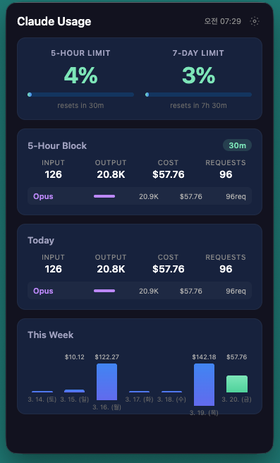
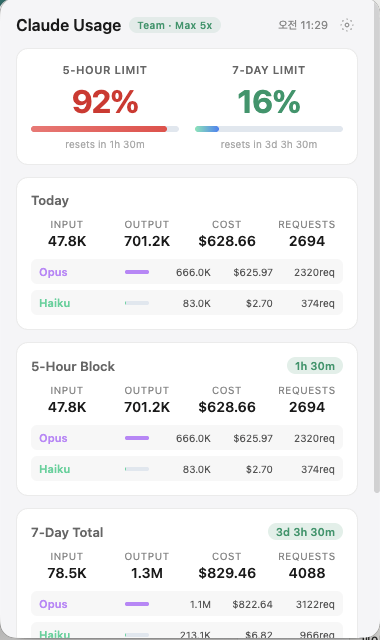

# Claude Usage Monitor

> Real-time Claude Code usage monitoring in your menubar. Know your limits before you hit them.


[](https://creativecommons.org/licenses/by-nc/4.0/)

<p align="center">
  
</p>

<p align="center">
  
  &nbsp;&nbsp;
  
</p>

## Highlights

- **Menubar at a glance** — Usage %, remaining time, cost displayed as pill-style badges
- **Dynamic color alerts** — Pill color changes automatically: green → yellow → orange → red as usage increases
- **Dark & Light theme** — Choose your preferred popup appearance
- **Zero config** — Reads Claude Code credentials automatically from macOS Keychain / Windows Credential Manager
- **Lightweight** — Worker thread parsing, mtime caching, minimal API polling (~9 tokens per check)

---

## Features

| Feature | Description |
|---------|-------------|
| **5H / 7D Usage** | Real-time utilization from Anthropic API response headers |
| **Dynamic Pill Colors** | Automatic color change by usage: 0~50% green, 50~75% amber, 75~90% orange, 90%+ red |
| **Popup Dashboard** | Per-model breakdown (Opus/Sonnet/Haiku), today's stats, 7-day chart |
| **Time Display** | Smart formatting: `4d2h30m` for long durations, `1h45m` for short |
| **Notifications** | macOS alerts at configurable thresholds (5H & 7D) |
| **Customizable Menubar** | Choose which items to show, drag to reorder, pick separator style |
| **Dark / Light Theme** | Toggle in popup Settings |
| **Project Breakdown** | Usage grouped by Claude Code project directory |
| **Auto Update** | Check for new releases from within the app |

---

## Popup Dashboard

| Section | Description |
|---------|-------------|
| **5-Hour Limit** | API-based 5h sliding window utilization (%) with progress bar & reset countdown |
| **7-Day Limit** | API-based 7-day utilization (%) with progress bar & reset countdown |
| **Today** | Today's accumulated tokens, cost, and requests with model breakdown |
| **5-Hour Block** | Local JSONL-based detail — tokens, cost, requests per model |
| **7-Day Total** | Weekly total with model breakdown |
| **This Week** | Daily cost bar chart (today highlighted in green) |

---

## Installation

### Prerequisites

- **Claude Code CLI** installed and **logged in** (Pro / Max / Team subscription)
- If not logged in, run `claude` in terminal and sign in

### Download

Go to [**Releases**](../../releases) and download the latest version:

| Platform | File |
|----------|------|
| macOS (Apple Silicon) | `*-arm64-mac.zip` |
| macOS (Intel) | `*-mac.zip` |
| Windows | `*.exe` |

**macOS:** Unzip → move to Applications → right-click → Open (first time only).

> **Gatekeeper blocked?** Run `xattr -cr /Applications/Claude\ Usage\ Monitor.app` in Terminal, then open again.

### Build from Source

```bash
git clone https://github.com/baekhj/claude-usage-monitor.git
cd claude-usage-monitor
npm install
npm start
```

---

## How It Works

### Authentication

No login required in this app. It reads OAuth credentials automatically:
- **macOS:** from Keychain entry `Claude Code-credentials`
- **Windows:** from Windows Credential Manager

On first launch, macOS may ask to allow Keychain access — click **"Always Allow"**.

### Usage Data (API)

Sends a minimal Haiku request (`max_tokens: 1`, cost < $0.001) to read utilization from response headers:

```
anthropic-ratelimit-unified-5h-utilization: 0.04
anthropic-ratelimit-unified-7d-utilization: 0.02
anthropic-ratelimit-unified-5h-reset: <unix-timestamp>
anthropic-ratelimit-unified-7d-reset: <unix-timestamp>
```

### Token & Cost Data (Local)

Parses JSONL files from `~/.claude/projects/**/*.jsonl` to aggregate tokens, cost, and requests per model/project/time period. Cost figures are **estimates** based on public API pricing.

---

## Settings

Access via the gear icon in the popup.

| Setting | Description |
|---------|-------------|
| **Menubar Items** | Check/uncheck and drag to reorder what's shown in menubar |
| **API Refresh Interval** | Polling frequency in seconds (min 10s, default 300s) |
| **Separator** | Choose between ` · ` `\|` `space` `/` |
| **Theme** | Dark / Light popup appearance |
| **Dynamic Pill Colors** | ON: auto color by usage % / OFF: pick static color per group |
| **Pill Colors** | When dynamic is off, choose per-group color (Plan, 5H, 7D) |
| **Notifications** | 5H thresholds (e.g. 50, 75, 90) and 7D thresholds (e.g. 75, 90) |
| **Launch at Login** | Start automatically on system boot |

---

## Project Structure

```
src/
├── main/
│   ├── index.js            # Main process (Tray, BrowserWindow, IPC, Worker)
│   ├── parser.js           # JSONL parsing with per-file mtime cache
│   ├── parser-worker.js    # Worker thread for non-blocking parsing
│   ├── settings.js         # Settings, pill colors, dynamic color logic
│   ├── usage-api.js        # Anthropic API (OAuth/Keychain)
│   ├── watcher.js          # File change detection (fs.watch)
│   ├── updater.js          # GitHub release auto-update
│   └── preload.js          # Context bridge for renderer
├── renderer/
│   ├── popup/              # Menubar popup (dark/light theme)
│   ├── dashboard/          # Full dashboard window
│   └── pill/               # Offscreen pill renderer for menubar
└── shared/
    ├── constants.js         # Model pricing, intervals, paths
    └── utils.js             # Formatters, cost calculation
```

## Privacy & Security

- Reads credentials **locally** from OS keychain — never stored or transmitted elsewhere
- Communicates **only** with `api.anthropic.com`
- No telemetry, no analytics, no third-party services
- All JSONL data read locally from `~/.claude/projects/`

## Known Limitations

- **Requires Claude Code login** — no standalone API key support
- **Cost estimates are approximate** — based on public pricing, may differ from actual billing
- **Not code-signed** — macOS Gatekeeper may block first launch

## Credits

The approach of reading rate-limit utilization from Messages API response headers was learned from [claude-code-stats](https://github.com/dmelo/claude-code-stats).

## Disclaimer

"Claude" is a trademark of Anthropic PBC. This application is an independent, unofficial tool and is **not affiliated with, endorsed by, or sponsored by Anthropic**. It uses only publicly documented APIs and locally stored data.

## License

<a rel="license" href="https://creativecommons.org/licenses/by-nc/4.0/">
  
</a>

This work is licensed under a [Creative Commons Attribution-NonCommercial 4.0 International License](https://creativecommons.org/licenses/by-nc/4.0/).

- **Free to use, share, and modify** for non-commercial purposes
- **Attribution required** — credit the original author
- **Commercial use prohibited** — selling or using in commercial products/services is not allowed
